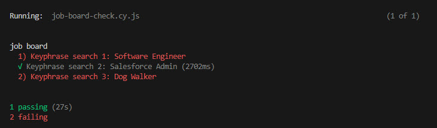
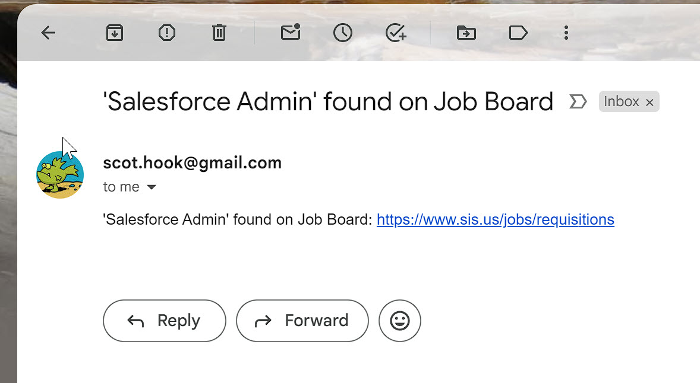

# Job Board Check

This is a Node.js project that uses Cypress and Nodemailer to check a job board for keyphrases and send an email for each keyphrase found. I use Windows Task Scheduler to run this regularly.

